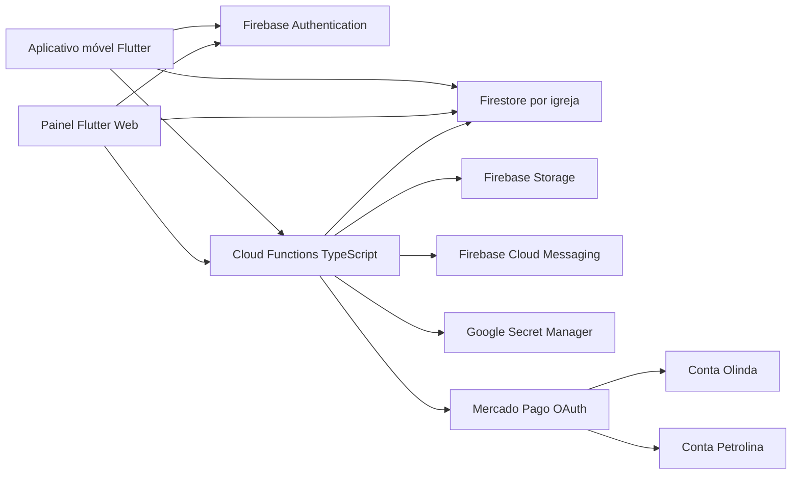
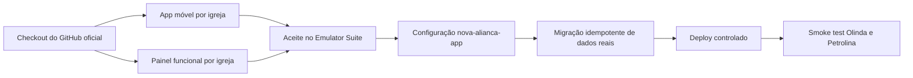

# Arquitetura multi-igreja e painel administrativo

**Status:** decisão arquitetural vigente  
**Atualização:** 16 de agosto de 2026  
**Base:** Nova Aliança App `1.3.0+10`

**Repositório GitHub:** `https://github.com/GabrielBielFerreira/Comunindade-Nova-alianca-APP`

**Checkout local:** `C:\Users\Jean\Downloads\CNA APP atualizado\Comunindade-Nova-alianca-APP`

## 1. Objetivo

Transformar o aplicativo atual, criado inicialmente para Olinda, em uma plataforma para toda a rede Nova Aliança. O primeiro marco terá Olinda e Petrolina, painel administrativo web separado e finanças isoladas por unidade.

Este documento deve ser lido depois de `CLAUDE.md` e `CONTEXTO_GERAL_APP_NOVA_ALIANCA.md`.

## 2. Decisões consolidadas

- Um único Firebase para toda a rede.
- Dados operacionais separados sob `/igrejas/{igrejaId}`.
- Aplicativo móvel para visitantes e membros.
- Painel Flutter Web separado para administração.
- Mesma identidade Firebase, interfaces e autorizações diferentes.
- Um membro possui igreja principal e pode visualizar outra sem transferir o vínculo.
- Cada unidade conecta sua própria conta Mercado Pago.
- Pastor, diácono, evangelista e líder acessam as finanças da própria igreja.
- Tesoureiro também acessa finanças, mesmo quando seu perfil comunitário é membro.
- Editor e moderador não recebem acesso financeiro por essas funções.
- Somente pastor da unidade ou superadministrador pode retirar alguém da liderança.
- Retirada é rebaixamento ou inativação auditada, nunca exclusão física.
- O aplicativo ainda não foi lançado; a migração será direta.

## 3. Visão de componentes



## 4. Limites de responsabilidade

### Aplicativo móvel

- Seleção e troca da igreja visualizada.
- Home, programação, avisos e campanhas da unidade selecionada.
- Cadastro e vínculo de membro.
- Bíblia e hinário.
- Pedidos de oração.
- Notificações.
- Contribuições destinadas a uma igreja explicitamente confirmada.
- Nenhuma gestão administrativa interna depois da transição.

### Painel web

- Login administrativo.
- Dashboard por igreja.
- Membros e liderança.
- Conteúdo e programação.
- Orações.
- Mídia e notificações.
- Finanças.
- Auditoria.
- Cadastro de unidades pelo superadministrador.

### Cloud Functions

- Autorizar toda mutação sensível.
- Impedir acesso cruzado entre igrejas.
- Manter auditoria.
- Integrar Mercado Pago.
- Processar webhooks.
- Enviar notificações.
- Executar rotinas administrativas e migrações controladas.

## 5. Modelo de dados

```text
usuarios/{uid}
  nome
  email
  telefone
  foto_url
  igreja_principal_id
  criado_em

usuarios/{uid}/notificacoes/{id}
usuarios/{uid}/tokens_dispositivo/{id}

igrejas/{igrejaId}
  nome
  slug
  ativa
  dados_institucionais
  branding
  pix_manual
  mercado_pago_status

igrejas/{igrejaId}/membros/{uid}
  status
  perfil
  funcoes_admin
  ministerio_ids
  aprovado_por
  aprovado_em
  atualizado_por
  atualizado_em

igrejas/{igrejaId}/avisos/{id}
igrejas/{igrejaId}/eventos/{id}
igrejas/{igrejaId}/campanhas/{id}
igrejas/{igrejaId}/ministerios/{id}
igrejas/{igrejaId}/devocionais/{id}
igrejas/{igrejaId}/pedidos_oracao/{id}
igrejas/{igrejaId}/transacoes/{id}
igrejas/{igrejaId}/auditoria/{id}
```

### Perfis e funções

Perfis comunitários:

- `pastor`
- `diacono`
- `evangelista`
- `lider`
- `membro`

Funções administrativas adicionais:

- `tesoureiro`
- `editor`
- `moderador_oracao`

Grupo derivado:

```text
lideranca_ministerial = pastor | diacono | evangelista | lider
```

Não salve `lideranca_ministerial` como uma permissão editável pelo cliente. Derive o grupo a partir do perfil validado no servidor.

## 6. Matriz de autorização

| Papel/função | Conteúdo | Aprovar membro comum | Orações | Finanças da unidade | Gerir liderança | Configurar igreja |
|---|---|---|---|---|---|---|
| Membro | leitura autorizada | não | próprias/públicas | próprias contribuições | não | não |
| Editor | CRUD de conteúdo | não | não | não | não | não |
| Moderador de oração | leitura | não | moderação | não | não | não |
| Tesoureiro | leitura | não | não | sim | não | não |
| Líder | CRUD | sim | moderação | sim | não | leitura |
| Diácono | CRUD | sim | moderação | sim | não | leitura |
| Evangelista | CRUD | sim | moderação | sim | não | leitura |
| Pastor | CRUD | sim | moderação | sim | sim | editar |
| Superadministrador | todas | sim | todas | consolidado | todas | todas |

Regras:

- Toda autorização é limitada ao `igrejaId` do vínculo aprovado.
- Um perfil de liderança inativo não possui acesso.
- Um tesoureiro inativo não possui acesso.
- Um usuário com múltiplos vínculos só acessa as unidades autorizadas.
- Selecionar uma unidade no frontend nunca concede permissão.
- Status financeiro definitivo só pode ser escrito pelo backend.

## 7. Gestão da liderança

### Operações

`promoverParaLideranca`

- Permitida a pastor da unidade ou `super_admin`.
- Define perfil ministerial.
- Registra perfil anterior e novo.
- Exige vínculo aprovado.

`removerDaLideranca`

- Permitida a pastor da unidade ou `super_admin`.
- Altera o perfil para `membro`.
- Remove funções administrativas incompatíveis.
- Mantém o vínculo aprovado.
- Preserva autoria de conteúdos, aprovações e histórico.

`desvincularDaIgreja`

- Permitida a pastor da unidade ou `super_admin`.
- Altera o vínculo para `inativo`.
- Revoga todas as funções administrativas da unidade.
- Impede novas leituras administrativas.
- Mantém documentos históricos.

`transferirVinculoIgreja`

- Exclusiva do `super_admin`. Pastor da unidade NÃO transfere.
- Move a igreja principal: inativa o vínculo de origem e aprova o de destino
  na MESMA transação, junto com `usuarios/{uid}.igreja_principal_id`.
- Não transporta perfil ministerial nem função administrativa: quem chega ao
  destino sem vínculo prévio entra como `membro`, sem função e sem ministério.
- Um vínculo JÁ APROVADO no destino conserva o perfil que era dele naquela
  unidade — a transferência não rebaixa permissão legítima alheia à origem.
- Transferir alguém com perfil `pastor` exige confirmação explícita
  (`confirmarSaidaDePastor`), porque a unidade pode ficar sem pastor.
- Idempotente: repetir a chamada com o estado final já aplicado devolve
  sucesso sem reescrever nada e sem gerar segunda auditoria.
- Audita nas DUAS unidades.

Não confundir com a troca de igreja VISUALIZADA no aplicativo: aquela é
preferência local de leitura, não passa pelo servidor e não altera permissão.

### Restrições

- Motivo obrigatório.
- Operação transacional.
- Auditoria obrigatória.
- Pastor não pode remover a si mesmo.
- Pastor não pode remover ou substituir outro pastor.
- Alteração de pastor exige `super_admin`.
- Líder, diácono, evangelista e tesoureiro não podem remover outro líder.
- Não excluir documentos de membro para representar saída.

## 8. Consultas e Rules

Helpers previstos nas regras/Functions:

```text
isSignedIn()
isSuperAdmin()
membership(igrejaId)
isApprovedMember(igrejaId)
isChurchLeadership(igrejaId)
isChurchPastor(igrejaId)
isChurchTreasurer(igrejaId)
canReadFinance(igrejaId)
canManageContent(igrejaId)
canModeratePrayer(igrejaId)
canManageLeadership(igrejaId)
```

`canReadFinance(igrejaId)` retorna verdadeiro somente quando:

```text
super_admin
OR perfil in [pastor, diacono, evangelista, lider]
OR funcoes_admin contains tesoureiro
```

Todas as condições exigem vínculo `aprovado` e a mesma igreja do recurso.

O Admin SDK ignora Firestore Rules. Portanto, toda Function deve chamar os mesmos helpers de autorização antes de ler ou alterar dados.

## 9. Painel web

Criar `admin_web/` e `packages/nova_alianca_core/` sem mover o app atual durante a primeira fase.

### Navegação

```text
/login
/recuperar-senha
/dashboard
/membros
/lideranca
/avisos
/eventos
/campanhas
/ministerios
/devocionais
/oracoes
/financas
/auditoria
/igrejas             super_admin
/configuracoes
```

### Comportamento por papel

- Liderança ministerial vê os módulos operacionais e financeiros da unidade.
- Tesoureiro vê dashboard e finanças; outros módulos dependem de funções adicionais.
- Editor vê conteúdo, sem finanças.
- Moderador vê oração, sem finanças.
- Pastor vê ainda “Gestão da liderança”.
- Superadministrador alterna entre todas as unidades.

O frontend esconde opções sem permissão, mas a segurança real permanece no backend e nas Rules.

## 10. Finanças e Mercado Pago

### Isolamento

- Cada transação fica em `/igrejas/{igrejaId}/transacoes/{id}`.
- Cada igreja conecta uma conta Mercado Pago própria.
- Olinda pode usar a conta pessoal autorizada somente no piloto.
- Petrolina não usa credenciais nem conta de Olinda.
- Não existe comissão ou split entre unidades nesta fase.

### OAuth

- Uma aplicação integradora Nova Aliança.
- Authorization Code com `offline_access`.
- Um segredo por igreja no Secret Manager.
- Renovação antes do vencimento.
- Nenhum token no app, painel, Firestore ou Git.

### PIX

1. App confirma igreja, tipo e valor.
2. Function verifica usuário, App Check e igreja ativa.
3. Function cria transação interna pendente.
4. Function carrega credencial da unidade.
5. Mercado Pago cria o PIX com idempotência.
6. App recebe QR Code/copia-e-cola.
7. Webhook assinado atualiza o status definitivo.
8. Liderança autorizada acompanha no painel.

### Webhook

- Validar `x-signature` e `x-request-id`.
- Resolver a igreja pelo recebedor Mercado Pago e referência interna.
- Consultar o pagamento na API.
- Conferir recebedor, valor, referência e ambiente.
- Atualizar idempotentemente.
- Nunca aceitar aprovação enviada pelo cliente.

### Acesso financeiro

Pastor, diácono, evangelista, líder, tesoureiro e superadministrador podem:

- consultar transações autorizadas;
- filtrar por período, status, tipo e campanha;
- visualizar totais;
- exportar CSV;
- consultar conciliação e identificador Mercado Pago.

Eles não podem editar manualmente o valor recebido nem transformar uma transação pendente em aprovada. O webhook/backend permanece como fonte de verdade.

## 11. Aplicativo multi-igreja

- Substituir `IgrejaInfo` estático por `IgrejaModel`.
- Criar `igrejaPrincipalProvider` e `igrejaVisualizadaProvider`.
- Fazer todo provider operacional depender do `igrejaId` visualizado.
- Limpar caches dependentes de igreja ao alternar.
- Tratar conteúdo privado conforme o vínculo na unidade visualizada.
- Exibir a unidade recebedora antes de qualquer contribuição.
- Separar tópicos FCM por igreja.
- Remover rotas administrativas internas quando o painel atingir paridade.

## 12. Migração

Como não existem usuários de produção:

1. Restaurar configuração Firebase.
2. Exportar o Firestore atual.
3. Criar `olinda` e `petrolina`.
4. Executar migração em `--dry-run`.
5. Copiar coleções atuais para subcoleções de Olinda.
6. Preservar IDs e timestamps.
7. Criar vínculos em Olinda.
8. Mapear perfis `pastor`, `diacono` e `lider` para a liderança ministerial.
9. Adicionar `evangelista` ao enum e às Rules.
10. Não converter líderes em tesoureiros; o acesso financeiro vem do perfil de liderança.
11. Validar contagens, Rules e consultas.
12. Remover dados antigos somente após backup e aceite.

## 13. Ordem de implementação

### Fase 0 — Ambiente

- Firebase, emuladores, baseline e backup.

### Fase 1 — Domínio e segurança

- Modelos de igreja/vínculo.
- Perfil `evangelista`.
- Helpers de liderança e finanças.
- Rules, índices e testes de isolamento.

### Fase 2 — Painel fundamental

- Login, dashboard, membros, liderança e auditoria.
- Testar promoção, rebaixamento e inativação.

### Fase 3 — Conteúdo e oração

- CRUD, mídia, notificações e moderação.

### Fase 4 — Aplicativo multi-igreja

- Seleção real, providers, cadastro e retirada da gestão interna.

### Fase 5 — Mercado Pago

- OAuth, Secret Manager, PIX, webhook e painel financeiro.

### Fase 6 — Lançamento

- App Check, testes end-to-end, staging, APK e produção.

## 14. Testes obrigatórios da nova regra

- Pastor de Olinda lê finanças de Olinda e não de Petrolina.
- Diácono de Olinda lê finanças de Olinda e não de Petrolina.
- Evangelista de Olinda lê finanças de Olinda e não de Petrolina.
- Líder de Olinda lê finanças de Olinda e não de Petrolina.
- Tesoureiro de Olinda lê finanças de Olinda e não de Petrolina.
- Editor sem perfil de liderança não lê finanças.
- Moderador sem perfil de liderança não lê finanças.
- Líder não remove outro líder.
- Diácono não remove líder.
- Evangelista não remove líder.
- Tesoureiro não remove líder.
- Pastor rebaixa líder com motivo e auditoria.
- Pastor inativa vínculo com motivo e auditoria.
- Pastor não remove a si mesmo nem outro pastor.
- Superadministrador consegue administrar liderança de qualquer unidade.
- Ex-líder perde acesso imediatamente e o histórico permanece intacto.
- Status de pagamento só muda pelo backend.

## 15. Critérios de aceite

- A matriz de permissões está implementada em UI, Rules e Functions.
- O enum `evangelista` existe no domínio, migração, painel e testes.
- Toda liderança ministerial acessa finanças apenas da própria igreja.
- Tesoureiro possui acesso financeiro sem precisar ser promovido a líder.
- Pastor possui gestão exclusiva do ciclo de vida da liderança da unidade.
- Nenhuma operação de saída apaga histórico.
- Olinda e Petrolina permanecem totalmente isoladas.
- Código, testes e documentação descrevem a mesma regra.

## 16. Adendo de execução (2026-08-16)

Ver `CLAUDE.md` §16 para o registro autoritativo. Pontos que afetam esta
arquitetura:

- **Contrato financeiro canônico** (`CLAUDE.md` §16.4): `/igrejas/{igrejaId}/
  transacoes/{id}` usa `usuario_id`, `igreja_id`, `valor_centavos` (inteiro),
  `tipo` (`dizimo|oferta|campanha`), `metodo` (`pix|checkout_pro`), `status`
  (`criando|pendente|aprovado|rejeitado|cancelado|estornado`), mais
  `campanha_id`, `mp_payment_id`, `mp_status_detail`, `criado_em`,
  `atualizado_em`, `aprovado_em`. Proibidos: `perfil_id`, `meio_pagamento`,
  `valor` em reais.
- **Migração direta** (`CLAUDE.md` §16.3): as regras finais **negam** os
  caminhos globais antigos; não há período de regras globais em paralelo. Os
  repositórios do app migram para o escopo por igreja na Fase 1.
- **Mercado Pago desativado** nesta fase (`CLAUDE.md` §16.5): o webhook sem
  validação de assinatura não é exportado como função ativa; fica em legado
  para a Fase 5.
- **Finanças somente leitura na Fase 2** (`CLAUDE.md` §16.6), após a correção
  do contrato financeiro.
- **Vulnerabilidades D.1, D.2, D.4, D.6** (`CLAUDE.md` §16.1) corrigidas nas
  Rules e nos repositórios da Fase 1.

## 17. Gate arquitetural de produção (2026-08-16)

### Identidade da base

O caminho local documentado acima é o checkout do mesmo repositório GitHub
oficial. A arquitetura multi-igreja implementada nessa branch deve evoluir nessa
base; não deve ser reconstruída em uma nova pasta por confusão entre Git remoto
e diretório de trabalho.

### Bloqueio P0

As Rules multi-igreja e os repositórios móveis não podem divergir. Enquanto
qualquer fluxo do app consultar coleções operacionais globais, as Rules finais
não estão autorizadas para produção. A correção P0 é tornar todos os fluxos do
app dependentes do `igrejaId` visualizado ou principal, conforme o domínio.

### Fluxo para produção



Regras do gate:

- `seed_emulador/` nunca é executado contra `nova-alianca-app`;
- nenhum card ou tabela do painel recebe valor hardcoded de demonstração;
- o build de produção nunca conecta no host dos emuladores;
- a migração preserva IDs e timestamps e não apaga as coleções antigas;
- Rules são publicadas somente depois que o app móvel estiver compatível;
- Mercado Pago legado não é incluído no deploy de produção;
- Petrolina nunca usa credenciais financeiras de Olinda.
