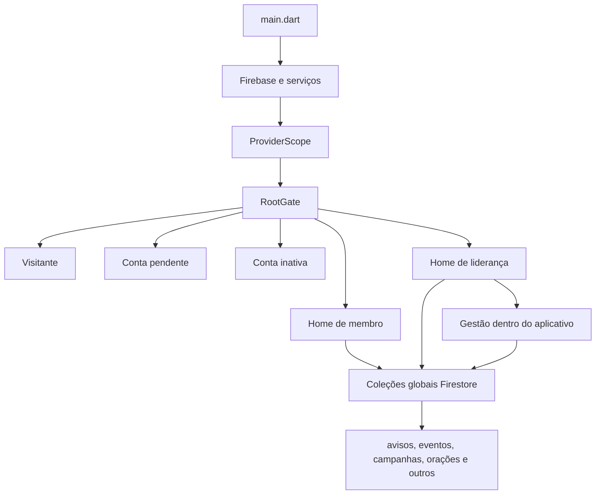
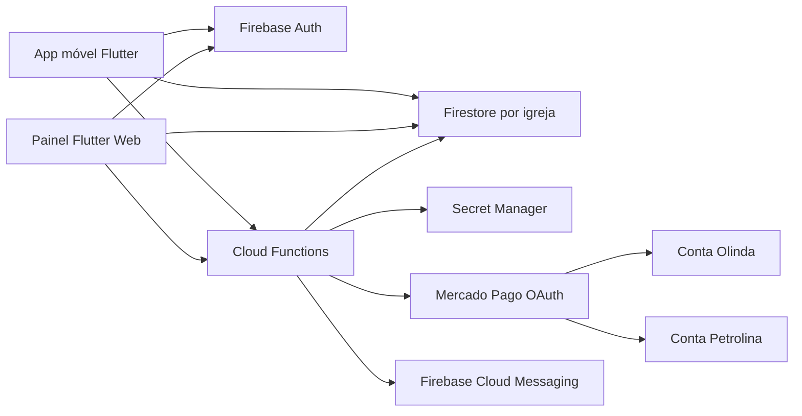

# Contexto geral — Nova Aliança App

**Data da análise:** 16 de agosto de 2026  
**Base analisada:** versão `1.3.0+10`  
**Situação:** aplicativo ainda não lançado; arquitetura multi-igreja e painel web são as prioridades.

## 1. Propósito deste documento

Este documento entrega ao Claude Code uma visão consolidada e verificada de:

- qual projeto é a base correta;
- o que já existe e funciona;
- o que existe apenas como protótipo ou estrutura incompleta;
- quais problemas foram confirmados;
- o que o produto deve se tornar;
- quais mudanças de design são permitidas;
- quais decisões não podem ser improvisadas durante a implementação.

Ele não substitui `CLAUDE.md` nem `ARQUITETURA_MULTI_IGREJA_E_PAINEL.md`. Use os documentos e o código real juntos.

## 2. Visão do produto

O Nova Aliança App será a plataforma digital de toda a Comunidade Nova Aliança, e não somente da igreja de Olinda.

O primeiro lançamento deve representar duas unidades:

1. Nova Aliança Olinda, sede e unidade atualmente configurada no código.
2. Nova Aliança Petrolina.

Depois disso, novas unidades devem ser cadastradas pelo painel administrativo sem necessidade de alterar e republicar o aplicativo.

O aplicativo móvel é voltado a visitantes e membros. O painel web é voltado a pastores, diáconos, evangelistas, líderes, tesoureiros, editores, moderadores e administração geral.

## 3. Projetos encontrados

### 3.1 Base funcional oficial

```text
C:\Users\Jean\Downloads\CNA APP atualizado\Comunindade-Nova-alianca-APP
```

Características:

- Flutter/Dart.
- Firebase Authentication.
- Cloud Firestore.
- Firebase Storage, Messaging, Crashlytics e Analytics previstos.
- Cloud Functions Node.js 20.
- Riverpod.
- Rotas nomeadas e partes com GoRouter.
- Android, iOS, Web e desktop gerados pelo Flutter.
- 155 arquivos Dart em `lib` no momento da análise.
- 14 arquivos de teste.
- 79 testes executados e aprovados.

Esta é a única base que já combina UI, autenticação, dados e regras.

### 3.2 Protótipo visual

```text
C:\Users\Jean\Downloads\Nova_Alinca_APP_flutter\nova_alianca_app
```

Características:

- Melhor acabamento visual em algumas telas.
- Seleção visual de Olinda e Petrolina.
- Home, programação, avisos, contribuição e outras telas simuladas.
- Login de demonstração com usuários fixos.
- Muitos estados mantidos apenas em memória.
- Entrada visual separada por `main_visual.dart`.
- Entrada chamada de produção com rotas que levam a placeholders.
- Apenas um teste básico sem cobertura de negócio.
- Existem alterações locais do usuário que precisam ser preservadas.

O protótipo pode fornecer componentes e referências de aparência, mas não pode substituir a base funcional.

### 3.3 Pasta com nome semelhante

```text
C:\Users\Jean\Downloads\Nova Alinça APP flutter
```

Essa pasta não contém o projeto Flutter completo. Ela possui metadados e um documento de migração. Não deve ser aberta como raiz principal pelo Claude Code.

### 3.4 APK analisado

```text
C:\Users\Jean\Downloads\NovaAlianca-v1.3.0 (1).apk
```

Informações verificadas estaticamente:

- Package: `br.com.novaalianca.nova_alianca_app`.
- Version name: `1.3.0`.
- Version code: `10`.
- Target SDK: 35.
- Compile SDK: 36.
- Min SDK efetivo: 24.
- Assinatura de produção válida, diferente de certificado debug.
- Firebase está embutido no APK.
- Assets visuais e hinário estão presentes.

O APK é compatível com a linha do projeto funcional. O binário não permite provar sozinho qual commit exato foi usado.

## 4. Arquitetura atual



### Entrada e autenticação

`lib/main.dart` inicializa Firebase, Crashlytics e o handler do FCM. Depois cria o aplicativo e entrega o fluxo de entrada ao `RootGate`.

O `RootGate` decide:

- sem usuário: tela de acesso/visitante;
- pendente: aguardando aprovação;
- inativo: conta inativa;
- aprovado: Home de membro ou liderança.

Problema conhecido: uma sessão anônima criada para pedido de oração também é um usuário Firebase. O `RootGate` atualmente pode tentar tratá-la como membro sem documento.

### Autenticação existente

- E-mail e senha.
- Google Sign-In.
- Cadastro como membro pendente.
- Recuperação de senha.
- Logout.
- Vinculação de senha a contas Google.
- Login anônimo usado para ações abertas de visitante.

### Estado e dados

- Riverpod fornece autenticação e streams de domínio.
- Repositórios acessam diretamente coleções globais.
- A maior parte da ordenação é feita no cliente.
- O código foi criado inicialmente para uma única igreja.

### Igreja atual

`lib/core/constants/igreja_info.dart` contém dados fixos de Olinda:

- nome e sigla;
- pastor;
- endereço;
- horários;
- PIX;
- Instagram;
- ministérios;
- documento Firestore `principal`.

Esses valores são consumidos diretamente por Home, ajuda, informações, configuração, programação e contribuição. Essa classe precisa ser substituída gradualmente por um modelo carregado do Firestore.

## 5. Funcionalidades existentes

| Área | Estado atual | Observação |
|---|---|---|
| Login e cadastro | funcional no código | depende de restaurar a configuração Firebase |
| Aprovação de conta | implementada | hoje ocorre dentro do aplicativo e sem igreja |
| Perfis membro/líder | implementados | papel é global, inadequado para várias unidades |
| Home | parcialmente real | mistura providers reais com informações fixas de Olinda |
| Avisos | repositório e telas reais | coleção global e leitura restrita a aprovados |
| Programação/eventos | repositório e telas reais | coleção global; visitante pode ser bloqueado pelas rules |
| Campanhas | repositório e telas reais | coleção global; integração financeira incompleta |
| Ministérios | repositório e administração | sem isolamento por igreja |
| Devocionais | repositório e administração | sem isolamento por igreja |
| Bíblia | funcional | API, cache, favoritos, histórico e voz |
| Hinário | funcional | JSON local, favoritos, histórico e fonte |
| Oração comum | grava no Firestore | pedidos entram para moderação |
| Mural de oração | implementado | regras precisam passar a considerar igreja |
| Oração urgente | não funcional | apenas valida e mostra confirmação visual |
| Notificações locais | funcional no código | lembretes de eventos |
| FCM | cliente parcialmente pronto | salva token e tópicos, mas falta backend de envio completo |
| Foto de perfil | incompleta | seleção local não persiste após reiniciar |
| Upload de imagens | incompleto | modelos possuem URL, formulários não fecham o fluxo |
| Painel administrativo | existe dentro do app | precisa ser substituído por site separado |
| PIX manual | funcional localmente | usa chave fixa de Olinda |
| Mercado Pago | backend inicial | não está ligado às telas e usa uma credencial única |
| Histórico financeiro | não funcional | não possui provider/repositório completo de transações |
| Presença/check-in | modelo morto | não há fluxo completo de gravação e consulta |
| Transmissão ao vivo | não funcional | não existe campo/integração completa |

## 6. Administração existente no aplicativo

Já existem telas Flutter para:

- aprovar e recusar cadastros;
- gerenciar avisos;
- gerenciar eventos;
- gerenciar campanhas;
- gerenciar ministérios;
- gerenciar devocionais;
- selecionar responsáveis;
- moderar oração.

Essas telas são úteis como referência de campos e regras de negócio. Entretanto:

- estão dentro do APK;
- usam permissões globais de liderança;
- não isolam igrejas;
- não possuem dashboard financeiro;
- foram construídas para celular, não para operação administrativa em computador;
- não centralizam todas as mutações sensíveis no servidor.

A estratégia correta é reutilizar conceitos, modelos e validações, não copiar cegamente as telas para o site.

## 7. Estado da seleção de igreja

O código visual já apresenta:

- busca de igreja;
- cards de Olinda e Petrolina;
- modal de confirmação;
- opção “Visualizar outra igreja”;
- aviso de que a igreja vinculada continua a mesma.

Porém, atualmente:

- as igrejas estão escritas diretamente no Dart;
- confirmar apenas navega ou devolve o nome da igreja;
- não existe `IgrejaModel` real;
- não existe provider de igreja atual;
- os repositórios continuam consultando dados globais;
- contribuição continua usando a chave PIX estática de Olinda.

O design existente deve ser conectado ao novo domínio em vez de ser descartado.

## 8. Estado do Firebase

### Firestore

Coleções globais atuais identificadas:

```text
usuarios
tokens_dispositivo
avisos
eventos
campanhas
pedidos_oracao
transacoes
igreja
ministerios
notificacoes
auditoria
devocionais
interesses_ministerio
configuracoes
```

As regras atuais:

- negam muitas operações por padrão;
- permitem ao próprio usuário editar parte do perfil;
- reconhecem pastor, diácono e líder como liderança;
- concedem à liderança acesso amplo/global;
- permitem criação de oração por usuário anônimo autenticado;
- impedem o cliente de confirmar pagamento;
- não conhecem vínculo por igreja.

### Storage

Existe regra para foto em `/perfil/{uid}/...` e uma área de avisos somente para leitura. Não existe estrutura completa por igreja para eventos, campanhas e outros uploads.

### Configuração ausente

O repositório possui `firebase.json`, mas não contém:

- `lib/firebase_options.dart`;
- `android/app/google-services.json`.

O APK prova que essas configurações existiam no ambiente que gerou a versão 1.3.0. Elas devem ser recuperadas pelo FlutterFire/Firebase atual e nunca improvisadas a partir de valores parciais.

## 9. Estado do Mercado Pago

O backend atual contém:

- criação de PIX;
- criação de preferência de Checkout Pro;
- documento pendente no Firestore;
- idempotência básica;
- webhook que consulta o pagamento e atualiza status.

Pendências confirmadas:

- uma única secret `MP_ACCESS_TOKEN` para todas as igrejas;
- `igrejaId` aceita valor padrão `principal`;
- nenhuma tela chama o serviço de pagamento online;
- histórico real não está conectado;
- `back_urls` e `notification_url` estão pendentes;
- a assinatura do webhook não é validada;
- não existe OAuth por igreja;
- não existe renovação de token;
- não existe dashboard financeiro;
- status usados no modelo Dart e Functions não estão totalmente alinhados.

### Modelo futuro decidido

- Uma aplicação integradora Nova Aliança.
- Uma conta Mercado Pago por igreja.
- Conexão por OAuth, sem compartilhar senha.
- Tokens guardados no Google Secret Manager.
- Pagamento criado com a credencial da unidade selecionada.
- Sem comissão da plataforma nesta fase.
- Sem mistura de Olinda e Petrolina.
- Sandbox antes de dinheiro real.
- Piloto real de Olinda pode usar temporariamente a conta pessoal autorizada.
- Petrolina só entra em produção quando o responsável local conectar a conta própria.

Referências oficiais:

- [OAuth Mercado Pago](https://www.mercadopago.com.br/developers/pt/docs/security/oauth/creation)
- [Renovação de token](https://www.mercadopago.com.br/developers/pt/docs/security/oauth/renewal)
- [Webhooks e assinatura](https://www.mercadopago.com.br/developers/pt/docs/your-integrations/notifications/webhooks)
- [Split 1:1 e contas de vendedor](https://www.mercadopago.com.br/developers/pt/docs/split-payments/split-1-1/prerequisites)

## 10. Arquitetura desejada



### Dados operacionais por igreja

```text
igrejas/{igrejaId}/membros
igrejas/{igrejaId}/avisos
igrejas/{igrejaId}/eventos
igrejas/{igrejaId}/campanhas
igrejas/{igrejaId}/ministerios
igrejas/{igrejaId}/devocionais
igrejas/{igrejaId}/pedidos_oracao
igrejas/{igrejaId}/transacoes
igrejas/{igrejaId}/auditoria
```

Essa estrutura reduz o risco de consulta cruzada e deixa a unidade explícita no caminho.

### Identidade e vínculo

- A conta Firebase é global.
- O perfil pessoal é global.
- Status, papel e funções são por igreja.
- Um membro possui `igreja_principal_id`.
- A igreja visualizada é um contexto local e temporário.
- O usuário pode contribuir para outra igreja sem mudar seu vínculo.
- Conteúdo privado depende de vínculo aprovado naquela unidade.

## 11. Painel web desejado

O painel deve ser um sistema operacional, não uma cópia ampliada das telas do aplicativo.

### Acesso

- URL separada.
- Login próprio.
- Recuperação de senha.
- Bloqueio sem função administrativa.
- Sessão expirada tratada corretamente.
- Seletor apenas entre igrejas autorizadas.

### Dashboard

- cadastros pendentes;
- próximos eventos;
- orações aguardando moderação;
- integração Mercado Pago;
- totais financeiros autorizados;
- alertas operacionais.

### Gestão

- igrejas;
- membros e papéis;
- avisos;
- eventos;
- campanhas;
- ministérios;
- devocionais;
- orações;
- notificações;
- uploads;
- auditoria.

### Finanças

- acesso a pastor, diácono, evangelista, líder e tesoureiro da própria unidade;
- visão consolidada para superadministrador autorizado;
- filtros por igreja, período, status, tipo e campanha;
- totais aprovados, pendentes, recusados e estornados;
- identificadores internos e Mercado Pago;
- exportação CSV;
- sem alteração manual de valores ou aprovação.

## 12. Permissões desejadas

Há duas dimensões relacionadas, mas diferentes:

1. Perfil comunitário: pastor, diácono, evangelista, líder ou membro.
2. Função administrativa: pastor, tesoureiro, editor ou moderador de oração.

Não misture as duas.

Exemplos:

- Pastor, diácono, evangelista e líder formam a `lideranca_ministerial` e possuem acesso ao painel financeiro da própria igreja.
- Um tesoureiro pode ter perfil comunitário `membro` e função administrativa `tesoureiro`.
- Um editor pode publicar eventos, mas não recebe acesso financeiro apenas por ser editor.
- Um moderador pode administrar orações, mas não recebe acesso financeiro apenas por ser moderador.
- Um pastor de Petrolina não pode consultar membros ou finanças de Olinda.
- Um líder de Olinda não pode retirar outro líder da igreja.
- Somente o pastor da unidade ou o superadministrador pode rebaixar ou inativar um integrante da liderança.
- Um superadministrador autorizado pode administrar a rede inteira.

### Ciclo de vida da liderança

“Excluir um líder” não significa apagar documentos ou histórico. Existem duas operações:

- Remover da liderança: a pessoa continua membro aprovado, mas perde o perfil/funções administrativas.
- Desvincular da igreja: o vínculo fica `inativo` e todo acesso à unidade é encerrado.

Somente pastor da própria unidade ou superadministrador executa essas operações. O motivo, autor e momento da alteração devem ser registrados. Um pastor não pode remover a si mesmo nem outro pastor; mudanças de pastor exigem superadministrador.

## 13. Problemas funcionais conhecidos

Prioridade crítica:

1. Firebase ausente no checkout impede build da base funcional.
2. Dados não possuem isolamento por igreja.
3. Liderança é reconhecida globalmente.
4. Painel administrativo está no lugar errado.
5. Pagamento usa uma única conta.

Alta prioridade:

1. Sessão anônima confundida com membro.
2. Visitante não consegue consultar corretamente programação/campanhas públicas.
3. Oração urgente não grava.
4. Mercado Pago não está conectado às telas.
5. Webhook não valida assinatura.
6. FCM não possui backend completo de publicação.
7. Foto e mídias não possuem persistência fechada.
8. Rotas diretas ainda podem exibir mocks.

Dívida técnica:

- telas com mais de mil linhas;
- navegação que pode empilhar rotas repetidas;
- fontes de estado paralelas;
- documentação histórica contraditória;
- poucos testes de widget e nenhum teste completo de integração;
- ausência de testes das rules no emulator;
- dependências com versões novas disponíveis, mas upgrade amplo não deve ser misturado à arquitetura.

## 14. Testes já executados

Na análise de uma cópia temporária:

- `flutter pub get` da base funcional foi concluído com acesso às dependências.
- `flutter analyze` encontrou somente os erros causados por `firebase_options.dart` ausente.
- Os 79 testes da base funcional passaram.
- O build Android parou na configuração Firebase ausente.
- O protótipo visual analisou sem erros e gerou APK debug por `main_visual.dart`.
- Nenhum dispositivo Android estava conectado, portanto não houve teste de ponta a ponta em aparelho.

Não interprete “79 testes passaram” como prova de que o aplicativo inteiro funciona. A cobertura é concentrada em modelos, validações, Palavra do Dia e poucos widgets.

## 15. Migração inicial

Como não há lançamento público, a migração pode ser direta:

1. Fazer backup/export do Firestore.
2. Criar Olinda e Petrolina.
3. Criar script idempotente e modo `--dry-run`.
4. Copiar dados globais existentes para subcoleções de Olinda.
5. Preservar IDs e timestamps.
6. Adicionar `igreja_principal_id = olinda` aos usuários existentes.
7. Criar vínculos correspondentes em Olinda.
8. Preservar os perfis existentes e conceder acesso financeiro ao grupo de liderança sem convertê-lo artificialmente em tesoureiro.
9. Conferir contagens e amostras.
10. Atualizar aplicativo, painel, Functions, rules e índices.
11. Remover as coleções antigas somente após verificação e backup.

## 16. Dados de Petrolina

O protótipo fornece apenas dados mínimos, como o nome da unidade e um endereço visual. Não trate todo conteúdo do protótipo como informação oficial.

O painel deve permitir cadastrar sem alteração de código:

- nome oficial;
- pastor responsável;
- endereço completo;
- localização;
- horários;
- contatos;
- Instagram;
- identidade visual;
- chave PIX manual;
- conta Mercado Pago;
- eventos, avisos, campanhas e ministérios.

Quando uma informação ainda não tiver sido confirmada, mostre estado “não configurado” no painel. Não invente dados para completar a demonstração.

## 17. O que pode mudar no design

O design não está congelado. Pode ser ajustado quando isso ajudar a funcionalidade e a clareza.

Mudanças permitidas:

- transformar seleção de igreja em componente real;
- exibir claramente a igreja atual;
- diferenciar “igreja vinculada” e “igreja visualizada”;
- criar estados de carregamento, vazio, erro e sem permissão;
- adaptar telas para dados de várias unidades;
- simplificar navegação inferior;
- remover botões simulados;
- criar componentes reutilizáveis;
- melhorar responsividade e acessibilidade;
- criar uma identidade de painel adequada a desktop;
- portar componentes melhores do protótipo visual.

Evitar agora:

- redesenhar todas as telas antes da arquitetura;
- trocar o sistema visual completo sem teste funcional;
- copiar telas do protótipo removendo providers e validações;
- gastar o primeiro ciclo em animações, ilustrações ou pixel perfect;
- manter recursos visíveis que apenas exibem mensagem de “futuramente”.

Regra de prioridade:

> O comportamento real e seguro vence a aparência. Depois que o fluxo estiver funcional, o protótipo pode orientar o refinamento visual.

## 18. Escopo da primeira demonstração funcional

A apresentação deve comprovar:

- duas igrejas reais no Firebase;
- seleção de Olinda ou Petrolina;
- mudança de Home, programação e avisos conforme a unidade;
- igreja principal preservada quando o usuário apenas visualiza outra;
- painel web com login separado;
- pastor de Olinda limitado a Olinda;
- responsável de Petrolina limitado a Petrolina;
- diácono, evangelista e líder acessando as finanças apenas da própria unidade;
- líder comum impedido de remover outro líder;
- pastor conseguindo rebaixar ou inativar um líder com motivo e auditoria;
- superadministrador alternando entre as duas;
- publicação pelo painel refletida no aplicativo;
- aprovação de membro por igreja;
- oração urgente chegando à moderação correta;
- dashboard financeiro isolado;
- Mercado Pago demonstrado em sandbox;
- conta real de Olinda somente na etapa de piloto autorizada.

## 19. Dependências externas

O código não consegue resolver sozinho:

- acesso administrativo ao projeto Firebase `nova-alianca-app`;
- restauração/geração das configurações FlutterFire;
- plano Firebase compatível com Cloud Functions e Secret Manager;
- criação/configuração da aplicação Mercado Pago integradora;
- autorização da conta pessoal para o piloto de Olinda;
- abertura e autorização da conta Mercado Pago de Petrolina;
- dados institucionais oficiais de Petrolina;
- domínio e endereço final do painel;
- validação contábil do uso de conta pessoal no piloto.

Quando uma dessas dependências bloquear uma fase, documente o bloqueio e continue apenas com sandbox/emulador, sem inserir credenciais falsas.

## 20. Resultado esperado

Ao final da arquitetura:

- o APK será um aplicativo de membros e visitantes;
- o site será a ferramenta de administração;
- cada igreja controlará seus próprios dados;
- finanças terão acesso restrito;
- pagamentos irão para a conta da unidade selecionada;
- Olinda e Petrolina coexistirão sem vazamento de dados;
- novas igrejas serão cadastradas pelo painel;
- nenhuma nova unidade exigirá copiar o projeto Flutter;
- o design poderá evoluir sobre uma base funcional e testável.

## 21. Adendo de execução (2026-08-16)

Correções verificadas contra o código real. Registro autoritativo em
`CLAUDE.md` §16.

- **Correção factual:** `AppConfig.multiIgrejaHabilitada` **é usada** em
  `lib/visual/screens/configuracoes_screen.dart` (~linha 202), condicionando a
  opção de troca de igreja. Está desligada por padrão, mas não é código morto.
- **Contrato financeiro canônico:** ver `CLAUDE.md` §16.4. O `TransacaoModel`
  atual (`perfil_id`, `meio_pagamento`, `valor` em reais, status
  `rejeitado/estornado`) diverge das Functions e será padronizado em centavos.
- **Migração direta:** sem período de regras globais inseguras em paralelo; as
  regras finais negam os caminhos globais antigos (`CLAUDE.md` §16.3).
- **Fase 2 com finanças somente leitura** após a correção do contrato
  (`CLAUDE.md` §16.6).
- **Riscos de segurança confirmados** (auto-promoção, auditoria forjável,
  exclusão física de histórico, reação de oração explorável): ver `CLAUDE.md`
  §16.1; corrigidos na Fase 1.
